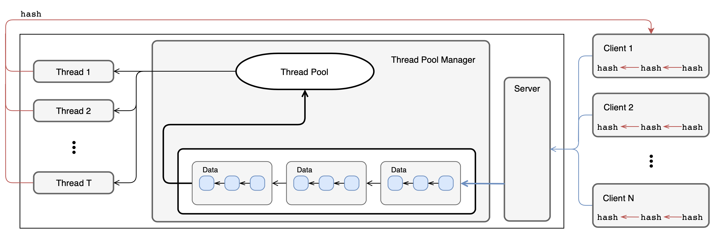

# Distributed Computing
**Using Thread Pools & Micro Batching to Manage and Load Balance Active Network Connections**  

This project focuses on developing a server to handle network traffic with the design of a custom tread pool. This thread pool is configurable to manage a number of threads that will be used to perform tasks relating to network communications. This includes:  

- Managing incoming network connections
- Receiving data over these network connections
- Organizing data into batches to improve performance
- Sending data over any of these links  

A thread pool manager maintains list of the work that needs to be performed by the threads. It maintains these work units in a FIFO queue implemented using a linked blocking queue. Each unit of work is either a connection to read in data, or a list of data packets with a maximum length of **batch-size**. Work units are added to the tail of the work queue when either: (1) a client is attempting to send data to be read, (2) the intermediary data queue has reached a length of **batch-size** or (3) a **batch-time** has expired since the previous unit was processed. An available worker thread is assigned to the work unit when an item is available in the queue.  

The high level architectural diagram outlining this process can be seen below.



## Components
### Server
There is exactly one server node in the system. The server node provides the following functions:

1. Accepts incoming network connections from the clients.  

2. Accepts incoming traffic from these connections.  

3. Groups data from the clients together into batches.  

4. Replies to clients by sending back a hash code for each message received. Hashes are generated using the SHA-1 algorithm.

*NOTE*: The server performs functions 2, 3 and 4 by relying on the thread pool

Every 20 seconds, the server displays its current throughput (number of messages processed per second during last 20 seconds), the number of active client connections, and mean and standard deviation of per-client throughput to the console. In order to calculate the per-client throughput statistics (mean and standard deviation), the throughputs for individual clients for last 20 seconds (number of messages processed per second sent by a particular client during last 20 seconds) and calculate the mean and the standard deviation of those throughput values are maintained.  

### Client
Unlike the server node, there are multiple Clients in the system. This can range from a single to thousands distributed amongst a network.  A client provides the following functionalities:  

1. Connect and maintain an active connection to the server.  

2. Regularly send data packets to the server. The payloads for these data packets are 8 KB and
the values for these bytes are randomly generated. The rate at which each connection will generate packets is *R* per-second. The typical value of *R* is between 2-10.

3. Track hash codes of the data packets that it has sent to the server. Hashes are generated using the SHA-1 algorithm. A server will acknowledge every packet that it has received by sending the computed hash code back to the client.  

A client maintains these hash codes in a linked list. For every data packet that is published, the client adds the corresponding hash code to the linked list. Upon receiving the data, the server will compute the hash code for the data packet and send this back to the client. When an acknowledgement is received from the server, the client checks the hash code in the acknowledgement by scanning through the linked list. Once the hash code has been verified, it can be removed from the linked list.  

Similar to the server, once every 20 seconds after starting up, every client displays the number of messages it has sent and received during the last 20 seconds.  

## Startup

Gradle is used for build automation, and can be executing manually with ```gradle clean; gralde build```. The application is constructed within a multi-layer package under **cs455.scaling**. Thus, the build directory will be constructed with the compiled class files under `/build/classes/java/main`, and then the command-line arguments and the order in which they should be specified for the server and the client nodes can be run by:  

* ```java cs455.scaling.server.Server server-port thread-pool-size batch-size batch-time```
* ```java cs455.scaling.client.Client server-host server-port message-rate```  

Once the server is started on the `server-host`, multiple clients can be instantiated on multiple or single machine. Java NIO is used to manage connections between the clients and server. To simplify the process of instantiating multiple instances, one of the provided run scripts can be used.  The `osx.sh` script is designed to be executed on MacOS, and the `run.sh` script is used for Linux (but configured to run in the lab at Colorado State University). Execution of the two scripts are nearly identical, but with subtle differences.

Within each of these scripts, it is possible to configure the **server-host**, **server-port**, **thread-pool-size**, **batch-size**, **batch-time**, and **messaging-rate** for the clients and server.  It is important that the server.  

### MacOS
Open up a terminal in the working directory of the project. The configuration can be set within the `osx.sh` script by changing the following variables:
```console
HOST=Jasons-MacBook-Pro.local
PORT=5001
RATE=10

POOL_SIZE=8
BATCH_SIZE=30
BATCH_TIME=5
```

Once the configuration is set, the server can be started.
```console
Jasons-MacBook-Pro:scalable-server-design stock$ ./osx.sh
Project has 1110 total lines

BUILD SUCCESSFUL in 0s
1 actionable task: 1 executed

BUILD SUCCESSFUL in 0s
2 actionable tasks: 2 executed
~/Development/cs/cs455/scalable-server-design/build/classes/java/main ~/Development/cs/cs455/scalable-server-design
cs455.scaling.server.Server(main:59) [INFO] - Server starting up at: Sat Mar 02 21:37:18 MST 2019
cs455.scaling.server.Server(start:112) [INFO] - Server starting on host: Jasons-MacBook-Pro.local, port: 5001
[2019-03-02 21:37:18] Server Throughput: 0.00 message(s), Active Client Connections: 0, Mean Per-client Throughput: 0.00 message(s), Std. Dev. Of Per-client Throughput: 0.00
```

This will spawn a new terminal, where the `osx.sh` script can be run again **once** to spawn *N* number of tabs where each client is instantiated. An example seen from the originating tab is:
```console
Jasons-MacBook-Pro:scalable-server-design stock$ cd /Users/stock/Development/cs/cs455/scalable-server-design/build/classes/java/main; java -cp . cs455.scaling.client.Client Jasons-MacBook-Pro.local 5001 10;
cs455.scaling.client.Client(main:64) [INFO] - Client starting up at: Sat Mar 02 21:37:40 MST 2019
```
At this point, there will be two terminals open; one dedicated to the server, and another with tabs corresponding to each client instance.  

### Linux
Open up a terminal in the working directory of the project. The configuration can be set within the `run.sh` script by changing the following variables:
```console
HOST=mars
PORT=5001
RATE=10

POOL_SIZE=8
BATCH_SIZE=30
BATCH_TIME=5
```

Add or remove desired client machines to the application. Each machine should be on a new line and can all be unique or the same.
```console
vim machine_list
```

Using the terminal, execute the run script to start the server and clients. (Optional) add an argument, integer, to launch more than one instance on a given host.
```console
mars:scalable-server-design$ ./run.sh
Project has 1110 total lines

BUILD SUCCESSFUL in 0s
1 actionable task: 1 executed

BUILD SUCCESSFUL in 0s
2 actionable tasks: 2 executed
```

At this point, there will be three terminals open; the original terminal, gnome-terminal for the server, and a gnome-terminal with tabs for each client instance.
